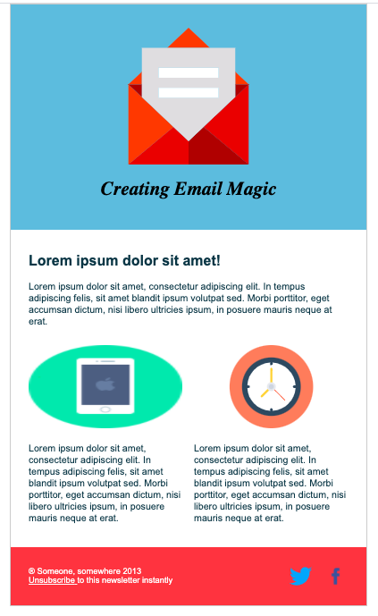

# HTML-Email-Template
This project creates an HTML Email Template using an online tutorial.

## Getting Started

This project will render if downloaded locally, and viewed in your default browser. This does not seem to be supported by GitHub Pages due to its additional use of Mark-Up langages other than HTML. 

* [GitHub Repository](https://github.com/jamierachael/HTML-Email-Template)
* [Deployed GitHub IO](https://jamierachael.github.io/HTML-Email-Template/)
* [Original Tutorial](https://webdesign.tutsplus.com/articles/build-an-html-email-template-from-scratch--webdesign-12770)

### Prerequisites

To install this application, you will need a text editor. I recommend Visual Studio Code. 

### Installing

To install this code, download the zip file, or use GitHub's guidelines to clone the repository. 

### To Execute File:
> Open in browser

## Authors

* **Jamie Rachael Morris** - *Initial work* - [Git Hub Profile](https://github.com/jamierachael)
* Tutorial wriiten by: Nicole Merlin

## Acknowledgments

* Please feel free to check out the original tutorial: 

* [Original Tutorial](https://webdesign.tutsplus.com/articles/build-an-html-email-template-from-scratch--webdesign-12770)